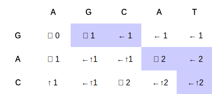
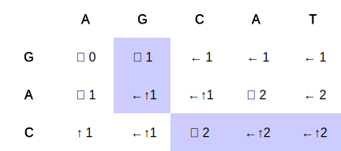
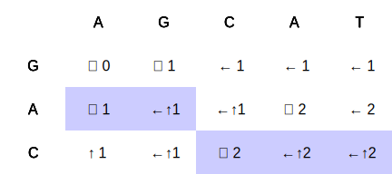
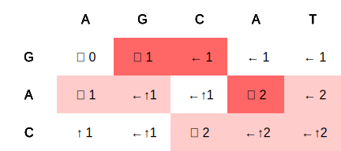

# Static Functions Provided by This Package

All of the functions provided by this package are static, and do not require you to instantiate a component.

## The "diff" Functions

### `gpii.diff.compare(leftElement, rightElement, [options])`

* `leftElement`: An element (array, object, number, etc.).
* `rightElement`: An element to compare to `leftElement`.
* `options` `{Object`} - Optional configuration options.  See below for supported options.
* Returns: `{Object}` - An object that describes the differences between the two elements.

This function compares two elements of any type and returns the most fine-grained comparison possible.  It automatically
calls functions below depending on the variable type and value, and its output exactly matches each of the examples
below for the same inputs.

### `gpii.diff.compareArrays(leftArray, rightObject, [options])`

* `leftArray`: An array of values.
* `rightArray`: An array of values to compare to `leftArray`.
* `options` `{Object`} - Optional configuration options.  See below for supported options.
* Returns: `{Array}` - An array of segments representing the changes in order.  May be larger than the original array (see below).

This function compares arrays in a way which is intended to assist in presenting changes to a list of values, in order.
For example:

```javascript
gpii.diff.compareArrays([0,1,2],[2,1,0]);

/* Returns:
[
    { value: 0, type: "removed"},
    { value: 2, type: "added"},
    { value: 1, type: "unchanged"},
    { value: 2, type: "removed"},
    { value: 0, type: "added"}
]
*/
```

The optional `options` object supports the following options:

* `lcsOptions`: Options for the comparison engine.  See `gpii.diff.longestCommonSequences` for details.

### `gpii.diff.compareMarkdown(leftMarkdown, rightMarkdown, [options])`

* `leftMarkdown` - A string containing markdown.
* `rightMarkdown` - A string to compare to `leftMarkdown`.
* `options` `{Object`} - Optional configuration options.  See below for supported options.
* Returns: `{Object}` A "diff" of the textual content of the two blocks of Markdown.

Compare the text of two Markdown strings and report their textual differences.  This function uses
[Markdown-It](https://github.com/markdown-it/markdown-it) to render the Markdown as HTML, and then extracts the text
using jQuery (in the browser) or [Cheerio.js](https://github.com/cheeriojs/cheerio) in Node.js.  You must install
`Markdown-It` and `Cheerio.js` as dependencies and call `gpii.diff.loadMarkdownSupport()` before you can use this
function.

The optional `options` object supports the following options:

* `markdownItOptions`: Options to pass to the markdown rendering engine when rendering strings as markdown.

### `gpii.diff.compareObjects(leftObject, rightObject, [options])`

* `leftObject`: An object.
* `rightObject`: An object to compare to `leftObject`.
* `options` `{Object`} - Optional configuration options.  See below for supported options.
* Returns: `{Object}` - An object that describes the differences (and similarities) between the two objects (see below).

This function compares two objects (including `undefined`) to one another and produces a report regarding their
similarities and differences.  Note that this function does not attempt to represent the addition and deletion of
intermediate tree segments, and errs on the side of describing changes in a place where a "simple" value (string,
number, boolean, etc.) might expect to be found.  For example:

```javascript
gpii.diff.compareObjects({}, { foo: { bar: { baz: true }}});

/* Returns:
{
    foo: {
        bar: {
            baz: [{ value: true, type: "added"}]
        }
    }
}
*/
```

The optional `options` object supports the following options:

* `lcsOptions`: Options for the comparison engine.  See `gpii.diff.longestCommonSequences` for details.
* `compareStringsAsMarkdown`: Set this to `true` if you want to render any string values contained in this object as
  markdown and then compare their text.  Set to `false` by default.
* `markdownItOptions`: Options to pass to the markdown rendering engine when rendering strings as markdown.


### `gpii.diff.compareStrings(leftString, rightObject, [options])`

* `leftString`: A string.
* `rightArray`: A string to compare to `leftString`.
* `options` `{Object`} - Optional configuration options.  See below for supported options.
* Returns: `{Array}` - An array of "segments" representing `rightString` as compared to `leftString` (see below).

This function compares two strings and creates a set of segments detailing what has changed (or remained the same)
between the two.  This function uses `gpii.diff.longestCommonStringPhrase` (see below) to split longer strings up into:

* Material before the longest common "phrase".
* The longest common "phrase".
* Material after the longest common "phrase".

The leading and trailing material from `leftString` and `rightString` is compared, and the process continues to recurse
until there are no common phrases.  Here is an example of the output:

```javascript
gpii.diff.compareStrings("this definitely works", "this also works");
/* Returns:
[
    { value: "this ", type: "unchanged"},
    { value: "definitely", type: "removed"},
    { value: "also", type: "added"},
    { value: " works", type: "unchanged"}
]
*/
```

The optional `options` object supports the following options:

* `lcsOptions`: Options for the comparison engine.  See `gpii.diff.longestCommonSequences` for details.
* `compareStringsAsMarkdown`: Set this to `true` if you want to render the strings as markdown and then compare their
  text.  Set to `false` by default.
* `markdownItOptions`: Options to pass to the markdown rendering engine when rendering strings as markdown.

### `gpii.diff.singleValueDiff(leftValue, rightValue)`

* `leftValue`: The left-hand value.
* `rightValue`: The right-hand value.
* Returns: `{Object}` - An array of change segments (see below).

This function returns a representation of a "single value" change, with no deeper comparison.  This function always
produces a two-segment change in which the left value is removed and the right value is added, for example:

```javascript
gpii.diff.singleValueDiff(0, 1); // [{ value: 0, type: "removed"}, {value: 1, type: "added"}]
```

You are almost always better off using `gpii.diff.compare` or another more specific function, which will call this
function as needed.

## Equality Functions

This package provides a handful of functions used to deeply compare arrays and objects.

### `gpii.diff.arraysEqual(leftObject, rightObject)`

* `leftObject`: An array of values.
* `rightObject`: An array of values to compare to `leftArray`.
* Returns: `{Boolean}` - `true` if all elements in both arrays are equal, `false` otherwise.

Compare two arrays to see if all of their values are equal.

### `gpii.diff.objectsEqual(leftObject, rightObject)`

* `leftObject`: An object.
* `rightObject`: An object to compare to `leftObject`.
* Returns: `{Boolean}` - `true` if the objects are deeply equal, `false` otherwise.

Deeply compare two objects to see if all of their values are equal.

## Diff Inspection Functions

This package provides key functions to inspect a single segment of a diff produced using one of the comparison functions
above.

### `gpii.diff.hasChanged(diff)`

* @param diff {Array} - An array of "diff" segments, as in `[{value: "foo", type: "removed"}, { value: "bar", type: "added"}]`.
* @returns {Boolean} - Returns `true` if the value has changes, `false` otherwise.

Examine a single segment of "diff" output and report whether it contains changes.

### `gpii.diff.leftValue(diff)`

* `diff` `{Array}` - An array of "diff" segments, as in `[{value: "foo", type: "removed"}, { value: "bar", type: "added"}]`
* Returns: `{Any}` - An array, string, or other value representing the "left" side of the diff.

Calculate the right side of a single diff segment by combining "removed" and "unchanged" segments.

### `gpii.diff.rightValue(diff)`

* `diff` `{Array}` - An array of "diff" segments, as in `[{value: "foo", type: "removed"}, { value: "bar", type: "added"}]`
* Returns: `{Any}` - An array, string, or other value representing the "right" side of the diff.

Calculate the right side of a single diff segment by combining "unchanged" and "added" segments.

## Supporting Functions

These functions are used by the comparison functions above, but are not guaranteed to be preserved as long term
features of this package

### `gpii.diff.calculateStringSegmentIndices(arrayOfStrings)`

* `arrayOfStrings` `{Array}` - An array of string segments, as produced by `gpii.diff.stringToLineSegments`.
* Returns: `{Array}` - An array of integers representing the position of each segment in the original string.

Go through the output of `gpii.diff.stringToLineSegments` and figure out what index in the original string each
segment corresponds to.

### `gpii.diff.calculateTightness(lcsSegments)`

* `lcsSegments` - An array of LCS segments, as returned from `gpii.diff.longestCommonSequence`.
* Returns: `{Number}` - A number representing the "tightness" (see below).

This function calculates the "tightness" of an array of LCS segments, where lower values are "tighter".  An array of
adjoining segments has a "tightness" of 0, as when evaluating the following:

`[{ leftIndex:0, rightIndex:0 }, { leftIndex:1, rightIndex:1}]`

An array that skips a single segment has a "tightness" of 1, as when evaluating the following:

`[{ leftIndex:0, rightIndex:0 }, { leftIndex:1, rightIndex:2}]`

This is used to sort segments so that the match with the most adjacent segments is preferred.

### `gpii.diff.combineDiff(diff, keys)`

* `diff` `{Array}` - An array of "diff" segments, as in `[{value: "foo", type: "removed"}, { value: "bar", type: "added"}]`
* `keys` `{Array}` - An array of keys to include in the results, which correspond to "type" values in individual diff segments.
* Returns: `{Any}` - An array, string, or other value representing the combined values of all relevant diff segments.

Go through a single diff segment and combine the segments whose "type" is found in `keys`.  Used by
`gpii.diff.leftValue` and `gpii.diff.rightValue`.

### `gpii.diff.compareStringsBySegment(leftString, rightString, [options])`

* `leftString` `{String}` - The first string, from whose perspective the "diff" results will be represented.
* `rightString` `{String}` - The second string, to compare to the first string.
* `options` `{Object}` - Configuration options to pass to the underlying difference engine.
* Returns `{Array}` - An array of "segments" representing `rightString` as compared to `leftString`.

Compare strings by "segment", where a segment is a block of non-word or word characters.

### `gpii.diff.compareStringsByLine(leftString, rightString, [options])`

* `leftString` `{String}` - The first string, from whose perspective the "diff" results will be represented.
* `rightString` `{String}` - The second string, to compare to the first string.
* `options` `{Object}` - Configuration options for the underlying difference engine.
* Returns `{Array}` - An array of "segments" representing `rightString` as compared to `leftString`.

Compare strings as sequences of "non-carriage returns" and "carriage returns", looking for entire lines that match.

### `gpii.diff.dedupeTracebackResults(rawTracebackResults)`

* `rawTracebackResults` `{Array}` - Any array of traceback sequences, as generated by `gpii.diff.tracebackLongestSequence`.
* Returns: `{Array}` - A new array containing only the unique values.

Return only the unique match sequences from traceback results.  Will only work on data that is sorted by match sequence,
by calling this function the original results will be sorted using  `gpii.diff.sortByMatchIndexes`.

### `gpii.diff.equals(leftElement, rightElement)`

* `leftElement` `{Any}` - An `{Object}`, `{Array}`, `{String}`, or any other type of element.
* `rightElement` `{Any}` - A second element of any type to compare to `leftElement`.
* Returns: `{Boolean}` - `true` if the elements are equal, `false` if they are not.

This function compares any two elements for equality, including Arrays and Objects.  It calls the type-specific
comparison functions (`gpii.diff.compareArrays`, et cetera) as needed.

### `gpii.diff.extractSegments(originalString)`

* `originalString` - A string to break down into segments.
* Returns: `{Array}` - An array of substrings of alternating "word" and "non-word" content.

Break down a string into an array of "segments" of alternating "word" and "non-word" content.  So, for example, the
phrase "Stop, please." would be broken down into:

`["Stop", ", ", "please", "."]`

Please note, this function treats `null` and `undefined` values the same as empty strings.

### `gpii.diff.generateTracebackTable(leftArray, rightArray, [options])`

* `leftArray` `{Array}` - An array of values.
* `rightArray` `{Array}` - An array of values to compare to `leftArray`.
* `options` `{Object`} - Optional configuration options.  See below for supported options.
* Returns: `{Array}` - An array of the longest common sequences (see above).

Generate a "traceback table" that can be used to determine the longest common sequence in two arrays.  Adapted from the
["Longest Common Subsequence" page on Wikipedia](https://en.wikipedia.org/wiki/Longest_common_subsequence_problem#Traceback_approach).

The results are an array of sequences. Each sequence segment is an object which indicates the left and right index of
the "match", as in this example, where only the first elements in both arrays match:

```json
[[{ "leftIndex": 0, "rightIndex": 0}]]
```

Note: `undefined` values are treated as empty arrays.

The optional `options` parameter supports the following parameter:
* `timeout`: The maximum execution time, in milliseconds (defaults to 1 second).

### `gpii.diff.isStringNullOrUndefined(value)`

* `value` `{Any}` - A value to evaluate.
* Returns: `{Boolean}` - Returns `true` if the value is a {String}, `undefined`, or `null`.  Returns `false` otherwise.

`gpii.diff.compareStrings` can perform a deeper comparison of {String}, `undefined`, and `null` values.  This function
is used to determine whether we can perform that deeper comparison.

### `gpii.diff.longestCommonSequence(leftArray, rightArray, [options])`

* `leftArray` `{Array}` - An array.
* `rightArray` `{Array}` - An array to compare to `leftArray`.
* `options` `{Object`} - Optional configuration options.  See below for supported options.
* Returns: `{Array}` - An array of objects describing the position of each segment in the longest common subsequence in the original arrays.

Compare two arrays, returning a single longest common sequence (not necessarily contiguous). See
`gpii.diff.longestCommonSequences` for further details.  If that function returns multiple sequences of the same length,
they are sorted using `gpii.diff.sortByLengthThenTightnessThenIndex` and only the first match is returned.

The optional `options` object supports the following options:

* `lcsOptions`: Options for the comparison engine.  See `gpii.diff.longestCommonSequences` for details.


### `gpii.diff.longestCommonSequences(leftArray, rightArray, [options])`

* `leftArray` `{Array}` - An array.
* `rightArray` `{Array}` - An array to compare to `leftArray`.
* `options` `{Object`} - Optional configuration options.  See below for supported options.
* Returns: `{Array}` - An array containing all "longest" sequences, i. e. different sequences (see above) that are equally long.

Compare two arrays and return all longest common sequences.  When comparing `[1,3,5,7]` to `[0,1,2,3,4,5,6]`, 
`[1,3,5,7]` is the longest sequence, and would be returned as the single entry in an array of results.  When comparing
`["A", "G", "C", "A", "T"]` to `["G", "A", "C"]`, `["G","C"]`, `["A","C"]`, and `["G","A"]` are all the same length,
and are all returned.

The output returned describes the match in terms of the position of each segment in `leftArray` and `rightArray`.
So, for example, when comparing `["foo","bar", "quux"]` to `["bar","baz", "qux", "quux"]`, this function would return:

`[{ leftIndex: 1, rightIndex: 0 }, { leftIndex: 2, rightIndex: 3} ] // "bar" and "quux"`

The optional `options` object supports the following options:

* `lcsOptions`: Options for the comparison engine, which include:
    * `timeout`: The number of milliseconds to wait before aborting the comparison.
    * `tracebackStrategy`: The traceback strategy to use.  The supported values are "full", and "single" (the default).
      See below for an explanation of the difference between the two.


#### Comparison Strategy

This function Follows a modified version of the "traceback" LCS approach outlined
in [the Wikipedia entry for LCS](http://en.wikipedia.org/wiki/Longest_common_subsequence_problem).  First, a "traceback"
table is generated, which looks something like the following:

<!-- Generated using src/js/lib/generate-traceback-diagram.js -->


The "traceback" is performed from the lowest right cell.  The symbols are as follows:

* ↑ indicates that the adjacent upward cell contains the same number of matches.
* ← indicates that the adjacent left cell contains the same number of matches.
* ↖ indicates a match in the current cell, and indicates that the rest of the pattern starts in the upper left diagonal
  square from ours.
* ╳ represents a terminal point, i.e. there is no match or inherited material beyond this point in the table.

There are two strategies available, a "full" traceback, and a "single" traceback strategy.
 
#### "Full" traceback

First, let look at the the more expensive "full" traceback, which uncovers all of the longest sequences.  Here are
three tables highlighting a path from the bottom right cell to each of the longest sequences.  First, let's look at one
of the several paths to the subsequence "GA" (cells visited are highlighted in blue, matches encountered are highlighted
in bold):

<!-- Generated using src/js/lib/generate-traceback-diagram.js -->


Next, let's look at the single path to the subsequence "GC":

<!-- Generated using src/js/lib/generate-traceback-diagram.js -->



Finally, let's look at the single path to the subsequence "AC":

<!-- Generated using src/js/lib/generate-traceback-diagram.js -->


Although this strategy gives us more control in selecting the best match from all possible longest matches, it is very
expensive, in that it not only determines all longest matches, but ends up traversing all paths to the same longest
matches.  Here is a diagram showing all the squares traversed in red.  The darker the shade of red, the more times the
same square has been traversed.

<!-- Generated using src/js/lib/generate-traceback-diagram.js -->


The comparison between G and G is evaluated three times, once for the unique path to "GC", but twice for the paths to
"AG".  Particularly when dealing with cases in which there is a fair amount of matching content separated by
non-matching content, the "full" traceback can become quite expensive.  The "single" traceback strategy (see below )is
far more performant, and used by default.

#### "Single" traceback

The "single" traceback strategy only attempts to return one of the longest common matches.  The key are the squares in
original diagram marked with both an upward and leftwards arrow.  If there is a choice, the "single" strategy only
follows the upward arrow.  Thus, its path through the same comparison looks like the following:

<!-- Generated using src/js/lib/generate-traceback-diagram.js -->


The colored squares above are each visited once.  Even in this simple comparison, the difference is clear.  The "single"
strategy visits five squares in total, versus the thirteen squares visited by the "full" strategy in its various paths
through the table.  There is also no need to evaluate and remove duplicate material when following the "single"
strategy. As a result, as the size and complexity of the comparison scales, the "single" strategy is orders of magnitude
faster than the "full" strategy.

### `gpii.diff.markdownToText(markdown, [markdownItOptions])`

* `markdown` `{String}` - A string containing markdown.
* `markdownItOptions` `{Object}` - Configuration options to pass to MarkdownIt.  See their docs for supported options.
* Returns: `{String}` - The textual content.

Use [Markdown-It](https://github.com/markdown-it/markdown-it) to render a string containing markdown as HTML, then
return the textual content.  You must install `Markdown-It` and `Cheerio.js` as dependencies and call 
`gpii.diff.loadMarkdownSupport()` before you can use this function.

### `gpii.diff.sortByLengthThenTightnessThenIndex(a, b)`

* `a` `{Array}` - An array of LCS segments.
* `b` `{Array}` - An array to compare with `a`.
* Returns: `{Number}` - `-1` if `a` is "first", `1` if `b` is "first", `0` if their position is interchangeable.

Sort arrays by the highest length, and then by the "tightest" grouping of elements (see `gpii.diff.calculateTightness`
above), then by the lowest (average) index of the first segment.

### `gpii.diff.sortByMatchIndexes(a, b)`

* `a` `{Object}` - A single sequence, an array of values like `{ leftIndex: 0, rightIndex: 1}`.
* `b` `{Object}` - A second sequence to compare to `a`.
* Returns: `{number}` - Returns `-1` if `a` should appear before `b`, `1` if b should appear before `a`, `0` if their position is interchangeable.

Sort two sequences by length, then by left indices, then by right indices.  Used by `gpii.diff.dedupeTracebackResults`
to ensure that duplicates appear immediately adjacent to one another.

### `gpii.diff.stringToLineSegments(originalString)`

* `originalString` `{String}` - A string to break down into line segments.
* Returns: `{Array}` - An array of substrings.

Split a string into "line segments" so that we can compare longer strings "by line".

### `gpii.diff.tracebackLongestSequences(tracebackTable, [options])`

* `tracebackTable` `{Array}` - A traceback table created using `gpii.diff.generateTracebackTable`.
* `options` `{Object`} - Optional configuration options.  See below for supported options.
* Returns: `{Array} - An array of the longest distinct sequences found in the traceback.

"Trace back" through the results of an array comparison created by `gpii.diff.generateTracebackTable`.  For a detailed
breakdown of the available "traceback" strategies and their advantages/disadvantages, see 
`gpii.diff.longestCommonSequence` for more details.

The optional `options` parameter can be used to change the traceback strategy used, as follows:

* `tracebackStrategy`: Can be `full` (find all longest sequences) or `single` (find just one, which is the default
  setting). See `gpii.diff.longestCommonSequence` for more details.
* `timeout`: The maximum execution time, in milliseconds (defaults to 10 seconds).

## Test Functions

### `gpii.test.diff.diagramTracebackAsText(leftValue, rightValue, tracebackTable)`

* `leftValue` `{Array}` - An array of values.
* `rightValue` `{Array}` - An array that was compared to `leftValue`.
* `tracebackTable` `{Array}` - A grid of "traceback" results generated by comparing `leftValue` (y-axis) to `rightValue` (x-axis).
* Returns: `{String}` - An ASCII representation of the traceback table.

Diagram a traceback table using ASCII characters, useful when analysing tracebacks generated using
`gpii.diff.generateTracebackTable`.  To use this, you must `fluid.require("%gpii-diff/js/lib/diagramTracebackAsText")`.
The output is as follows:

```text
/*

    ------------------------------------------
    |     ||   A ||   G ||   C ||   A ||   T |
    ------------------------------------------
    |  G  ||  *0 ||  \1 || _ 1 || _ 1 || _ 1 |
    ------------------------------------------
    |  A  ||  \1 || _|1 || _|1 ||  \2 || _ 2 |
    ------------------------------------------
    |  C  ||  |1 || _|1 ||  \2 || _|2 || _|2 |
    ------------------------------------------

*/
```

A pipe (|) indicates that the adjacent upward cell contains the same number of matches.  An underscore (_) indicates
that the adjacent left cell contains the same number of matches.  A backslash (\) indicates a match in the current cell,
and indicates that the rest of the pattern starts in the upper left diagonal square from ours.  An asterisk (*)
represents a terminal point, i.e. there is no match or inherited material to continue.

The "traceback" is performed starting in the lowest right cell.  See `gpii.diff.longestCommonSequences` for an
explanation of the two traceback strategies available.


